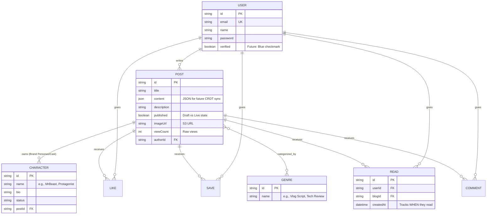

# Content Studio: Scalable MVP Architecture

This document serves as the foundational blueprint for a highly scalable "Studio" platform designed for content creators, scriptwriters, and influencers.

> [!IMPORTANT]
> **User Review Required**
> Please review the expanded "Pitfalls" section detailing the S3 architectural fix, as well as the detailed notes on the backend router logic we have already completed.

## 1. Problem Statement & Solution

**The Problem:** 
Influencers, YouTubers, and Screenwriters lack a specialized ecosystem. Currently, they draft in Google Docs/Notion, track engagement on YouTube/Twitter, and hunt for jobs on LinkedIn. These tools are disconnected. Furthermore, writers have no verified way to say: *"My scripts generate a 90% read-through rate"* because text editors don't track engagement.

**The Solution:** 
A specialized **"Creator Studio"**. It combines a powerful block-based text engine (optimized for scriptwriting, storyboarding, and persona tracking) with a public portfolio feed. By tying read/view analytics directly to the published scripts, writers build a verifiable portfolio of their impact.

## 2. Scalable Architecture Foundations (Avoiding Future Pitfalls)

To ensure this MVP can scale into a massive collaborative studio later, we must lay these concrete foundations today:

1. **The CRDT Pitfall (Collaboration):** If we store scripts as HTML, building real-time multiplayer editing (like Google Docs) later will be nearly impossible. 
   *Solution:* We use TipTap to store content as a strict **JSON Document Model**. This is instantly compatible with Yjs (Conflict-free Replicated Data Types) when we build the "Teams" feature.
2. **The Serverless Exhaustion Pitfall:** Cloudflare Workers are serverless. If 1,000 users load a script, the worker spins up 1,000 separate DB connections, crashing PostgreSQL.
   *Solution:* We strictly route all DB calls through **Prisma Accelerate** for edge-based connection pooling.
3. **The Heavy Payload Pitfall:** Pushing videos/images through our Workers will hit Cloudflare's memory limits and cost a fortune in bandwidth.
   *Solution:* The MVP relies purely on **S3 Presigned URLs**. The client browser uploads directly to AWS S3, completely bypassing our backend infrastructure.
4. **The S3 Access Denied Pitfall:** Even when presigned URL uploads succeed, the objects often return "Access Denied" when accessed publicly. This is a common AWS configuration conflict.
   *Solution:* We must configure a strict **Bucket Policy** that grants `s3:GetObject` to `*` (everyone) for the specific media folder. We also must ensure our Presigned URL generation strictly matches the `Content-Type` of the upload, and we disable restrictive "Block Public Access" settings at the bucket level while enforcing secure CORS rules to only allow our frontend domain to initiate the uploads.

## 3. Entity-Relationship (ER) Diagram

Below is the highly scalable database architecture we have designed to support this vision.

## 4. MVP Execution Phases

### Phase 1: Infrastructure, Data Types, & Foundational Routers (✅ Completed)
*What we have already done to set the stage:*
- **Database Schema:** Mapped out the ER diagram above perfectly into `schema.prisma`.
- **Common Types:** Created strict TypeScript definitions (`@kartik010700/common`) to ensure frontend and backend API responses NEVER mismatch.
- **Router Changes (Already Applied):**
  - Updated `backend/src/routers/blog.ts`: Modified the `GET /:id` route to automatically increment the `viewCount` in the database whenever a script is loaded by a reader.
  - Created `backend/src/routers/analytics.ts`: Scaffolded the route that performs Prisma aggregations (summing up `views`, `likes`, `reads`, `saves`) for the Creator Dashboard portfolio.

### Phase 2: The Studio Engine (Frontend Writer)
- Build the `StoryEditor` using TipTap JSON exports.
- Build the Sidebar UI to manage the `Characters/Personas`.
- Implement local autosave logic to prevent data loss.

### Phase 3: The Content Feed & Interactions
- Wire up the remaining Hono Backend routers (`/interactions`).
- Ensure the Feed implements cursor/offset pagination to handle 10,000+ scripts without lagging.
- Link the S3 Presigned URL upload hook directly into the TipTap image block.

### Phase 4: Premium UI/UX Polish
- Apply the "Sleek Professional Studio" aesthetic (Dark mode, glassmorphism, minimal noise).
- Implement Framer Motion for buttery-smooth page transitions.
