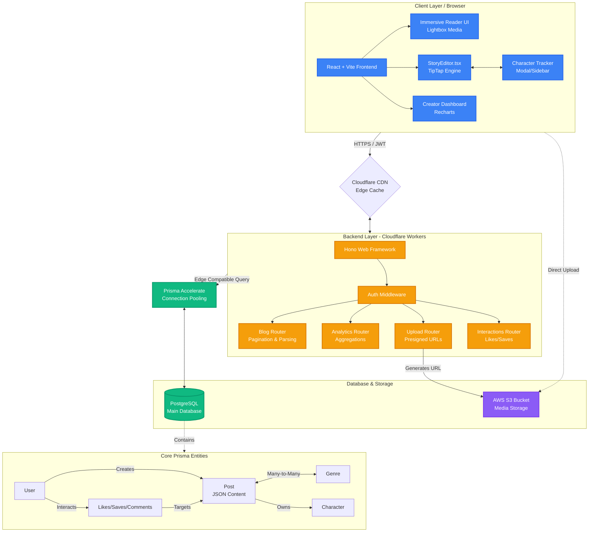

# Immersive Story Platform: System Design Architecture

> [!NOTE]
> Below is the precise architecture diagram for the platform. It maps out the flow from the client devices through the Edge Network to the Cloudflare Workers, Prisma Accelerate, and the PostgreSQL database.
>
> *(You can copy this exact Mermaid syntax and paste it into **draw.io** by going to `Arrange > Insert > Advanced > Mermaid...` to get a native draw.io file, or just view it perfectly rendered below!)*

## How the Data Flows

1. **Writing a Story (Writer flow):**
   - The writer opens `StoryEditor.tsx` (TipTap).
   - They type `@John`. The UI triggers the `Character Tracker` state, sending a temporary JSON object.
   - When they hit Save, the frontend hits the `Blog Router` with the TipTap JSON document, Title, and Genre IDs.
   - Images are uploaded directly from the browser to the `AWS S3 Bucket` using a presigned URL fetched from the `Upload Router`.
   
2. **Reading a Story (Reader flow):**
   - The reader visits a story URL. The request hits `Cloudflare CDN`. If cached, it returns instantly (<50ms).
   - If not cached, the `Blog Router` fetches the JSON from `PostgreSQL` via `Prisma Accelerate`.
   - The React frontend receives the JSON, parses it, and renders the `Immersive Reader UI`.
   - The reader clicks "Like". The `Interactions Router` validates the JWT and updates the database, simultaneously updating the post's metrics for the `Analytics Router`.
